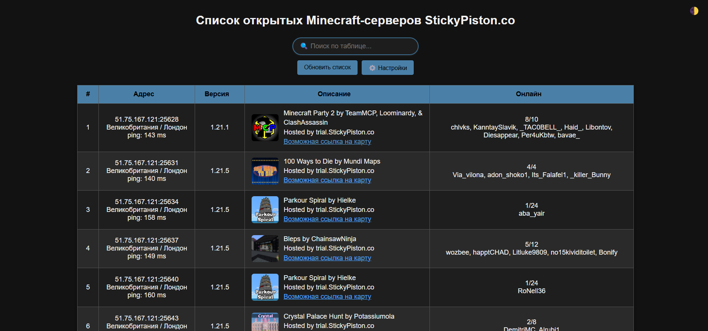

# 🧭 MCPing

**MCPing** — это асинхронный сканер Minecraft-серверов с веб-интерфейсом и консольной версией. Изначально задумывался для поиска открытых серверов на [https://trial.stickypiston.co](https://trial.stickypiston.co), но подходит для любого списка IP.




## 👀 Демонстрация

Ниже продемонстрирован функционал web-интерфейса программы


## 🚀 Возможности

* Поиск Minecraft-серверов в указанном диапазоне IP и портов
* Отображение информации: MOTD, иконка, пинг, геолокация, игроки
* Поиск возможной ссылки на карту (для серверов StickyPiston)
* Удобный веб-интерфейс с фильтром, сортировкой, обновлением и настройками и разными темами
* Поддержка консольной версии
* Хранение и редактирование настроек через файл или API

## 🛠️ Технологии

* **Python 3.11+**
* Backend: FastAPI, `mcstatus`, `aiohttp`
* Frontend: чистый HTML/CSS/JS (без фреймворков)
* Упаковка: PyInstaller

## 📦 Установка и запуск

Есть 3 пути: 
1. Скачать готовую сборку
2. Установить и запустить всё самому
3. Установить и собрать `.exe` самостоятельно

Для Windows подготовлены для `.cmd`-скрипты для установки и запуска приложения.

### 🌪️ Скачать готовую сборку

Самый простой способ для Windows - скачать одну из готовых сборок
 `.exe` в [релизах](https://github.com/Mideks/MCPing/releases).


### 🔧 Быстрый старт (venv, всё автоматом)
Требуется установленный **Python 3.11+**.
```cmd
install.cmd
run_app_web.cmd     :: для запуска веб-интерфейса
run_app_console.cmd :: для запуска консольной версии
```

Скрипты создадут виртуальное окружение, установят зависимости и запустят нужную версию.

### 🐍 Установка вручную

```bash
python -m venv venv
venv\Scripts\activate
pip install -r requirements.txt
python app_web.py  # веб-интерфейс
python app_console.py   # консольная версия
```

### 🛠 Сборка .exe

Для упаковки в `.exe` используется PyInstaller. Пример:

Для консольной версии:
```bash
pyinstaller --onefile app_console.py    
```

Для веб-версии нужно дополнительно упаковать шаблоны и статику:
```bash
pyinstaller --onefile --add-data "templates;templates" --add-data "static;static" app_web.py    
```

## ⚙️ Конфигурация

Настройки хранятся в файле `config.json`. Их можно менять через веб-интерфейс или вручную:

```pyton
{
  "target_ips": ["51.75.167.121", "88.198.26.90"], # IP-адреса для сканирования
  "port_start": 25565, # начало диапазона портов
  "port_end": 25700, # конец диапазона портов
  "timeout": 1, # время ожидания от серверов 
  "concurrency_limit": 100 # количество одновременных подключений
}
```

Чем больше адресов и шире диапазон портов, тем дольше будет сканирование!
Для ускорения можно увеличить `concurrency_limit`, но не стоит ставить слишком большие значения.

Также, если сервера не находит, возможно, выставлен слишком маленький `timeout`. 
Если проблема сохраняется, попробуйте включить VPN, если он выключен, или выключить, если он включен :)

Расчётное время сканирования:
```txt
time = (len(target_ips) * (port_end - port_start)) // concurrency_limit * timeout
```


## 🧪 Пример использования

На примере веб-интерфейса:
1. Запусти приложение.
2. Открой веб-интерфейс (обычно оно само откроет [http://127.0.0.1:8000](http://127.0.0.1:8000)).
3. Отредактируй настройки или оставь по умолчанию
4. Нажми кнопку "обновить" - получи список активных серверов.
5. Введи в строку поиска всё что угодно, чтобы оставить только нужные варианты (это может быть версия, описание, ник игрока и тд)
6. Отсортируй сервера, кликнув по заголовку таблицы. Кликни ещё раз, чтобы изменить направление сортировки. Как происходит сортировка:
    - "Адрес" - сортирует по пингу
    - "Версия" - сортирует версии в лексиграфическом порядке
    - "Описание" - сортирует описания по алфавиту
    - "Онлайн" - сортирует по количеству игроков онлайн


## 💡 Почему и зачем?

Проект начался как простая утилита для сканирования trial-серверов, но затем разросся до полноценного интерфейса. Это pet-проект — полезный, живой и просто прикольный.

Обязательно зацените разные темки в веб-интерфейсе!

## 🤝 Участие

Pull requests приветствуются. Есть идея? — [Создай issue](https://github.com/Mideks/MCPing/issues).

## 📄 Лицензия
MIT